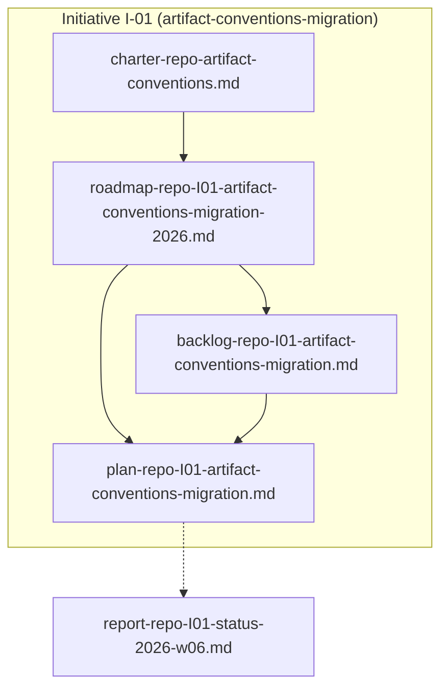
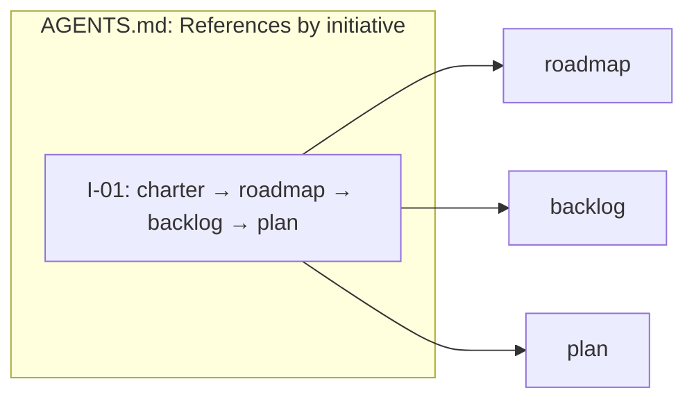

# Assessment: Initiative Naming and Traceability

**Purpose:** Propose a consistent initiative naming scheme so roadmap → backlog → plan → tickets stay traceable and "which file is the latest plan we care about" is unambiguous.

**Context:** Current naming grammar is `<type>-<endeavor>[-<scope>]-<subject>[-<timeframe>].md`. Subject (e.g. `artifact-conventions-migration`) ties related docs but is long and not a single token. Backlog already uses B1..Bn per backlog; no initiative-level ID exists.

---

## Expert Panel: Initiative Naming and Traceability

**Panel members:**

- **senior-pm** (strategic program / portfolio)
- **product-manager** (roadmap, backlog, PRD)
- **product-analyst** (requirements, analysis)
- **implementation-planner** (execution plans, steps)
- **ticket-management** (workflow, queries, hygiene)

---

### senior-pm

Portfolio-level clarity requires one stable identifier per initiative that survives renames and is easy to communicate. Recommend:

- **Initiative code:** Short, unique token per initiative (e.g. numeric `I-01`, `I-02` or acronym `ACM` for artifact-conventions-migration). Decide at roadmap creation and never reuse within the same endeavor.
- **Single source of initiative list:** Roadmap directory (or a small index) is the registry. Each roadmap file’s front matter should declare `initiative: I-01` (or equivalent). Backlogs and plans reference that same code so status reports and standups can say “I-01” and everyone knows which roadmap/backlog/plan set.
- **Filename vs. content:** Filenames can stay human-readable (`roadmap-repo-artifact-conventions-migration-2026.md`); the initiative code in front matter and in `.docs/AGENTS.md` references is what agents and humans use for “current initiative.” Optional: embed code in filename for grep (e.g. `roadmap-repo-I01-artifact-conventions-migration-2026.md`) if you want one-place discovery.

---

### product-manager

Roadmap owns “what we’re going for”; backlog and plan are downstream. To avoid “which plan is latest” confusion:

- **Roadmap as anchor:** Each roadmap gets one initiative code when created. All linked artifacts (backlog, plan) must declare the same code in front matter and in their “Links” section. That gives a bidirectional chain: roadmap ↔ backlog ↔ plan.
- **Backlog item IDs:** Current pattern (B1, B2, …) per backlog is good. For cross-initiative clarity, optionally prefix with initiative: `I01-B1`, `I01-B2`. That helps when one report or plan references items from multiple backlogs. If you only ever have one active backlog per initiative, plain B1..Bn is enough and plans already reference “B5” unambiguously.
- **Naming in AGENTS.md:** The “References” / override section should list by initiative code as well as path, e.g. “Initiative I-01 (artifact-conventions-migration): charter …, roadmap …, backlog …, plan …”. Then “current plan we care about” = “plan for I-01” = one lookup.

---

### product-analyst

Traceability from outcome → change → step is already partly there (roadmap outcome column in backlog, plan steps reference backlog items). The gap is naming at the initiative level:

- **Stable initiative identifier:** Use a single field, e.g. `initiative: I-01`, in front matter of roadmap, backlog, and plan. Same value in all three. Analysts and reports can then group by initiative and filter “everything for I-01” without parsing filenames.
- **Reports and status:** Status reports already use `report-<endeavor>-<topic>-<timeframe>.md`. Adding initiative to topic helps: `report-repo-I01-status-2026-w06.md` or in front matter. Enables queries like “all reports for I-01.”
- **Ticket hygiene (from ticket-management):** Consistent naming is a data-quality standard. Initiative code is a required field for any canonical doc that belongs to an initiative; backlog items already have ID (B1..Bn). No need to over-engineer: one code per initiative, one ID per backlog item, plans reference by backlog ID.

---

### implementation-planner

Plans need to point at backlog items and roadmap outcomes without ambiguity. Current plan already references backlog by filename and uses “B5”, “B6” in step tables. That works as long as:

- **One active plan per initiative:** If the convention is “one plan per initiative” and plan filename includes subject (e.g. `plan-repo-artifact-conventions-migration.md`), then “latest plan for this initiative” is the single plan file in that initiative’s set. Initiative code in front matter reinforces it and helps tooling.
- **Backlog item IDs in plan steps:** Keep referencing by backlog ID (B1, B2, …). If backlogs ever get merged or we have sub-initiatives, prefixing with initiative (I01-B1) avoids collisions. For current single-backlog-per-initiative model, B1..Bn is sufficient.
- **Roadmap outcome in plan:** Plan can cite “Roadmap outcome 2” or “Outcome 2 (I01)” so implementation stays aligned with roadmap. Initiative code on the roadmap and in the plan ties them.

---

### ticket-management (skill)

Workflow and query patterns support this:

- **Initiative as “project” or “epic”:** In systems that have projects/epics, initiative code maps to that. In markdown-only, the initiative code is the epic key; backlog items (B1..Bn) are the work items. Standard: required fields on creation (e.g. initiative, backlog ID, roadmap outcome).
- **Query pattern:** “All work for I-01” = filter where roadmap/backlog/plan share same initiative code. “Open items for current initiative” = backlog items not yet marked done in the plan. Saved views (e.g. “My I-01 tasks”) depend on stable initiative and item IDs.
- **Dashboard/reporting:** Executive view = by initiative (I-01, I-02); each initiative row shows roadmap outcomes, backlog count, plan progress. Initiative code is the grouping key.
- **Data quality:** Add to maintenance cadence: “Initiative code present and consistent across roadmap, backlog, plan for each initiative.”

---

## Synthesis

**Consensus:**

1. **Introduce an initiative code** (e.g. `I-01` or short acronym like `ACM`) assigned when the roadmap is created. Same code used in roadmap, backlog, and plan (front matter + optionally filename).
2. **Keep backlog item IDs** as today (B1, B2, … per backlog). Optionally prefix with initiative (`I01-B1`) only if you need cross-backlog uniqueness in one report/plan.
3. **Single source of “current” set:** For a given initiative, the canonical set is (charter if shared) + roadmap + backlog + plan. `.docs/AGENTS.md` (or a small index) can list “Initiative I-01: charter …, roadmap …, backlog …, plan …” so “latest plan we care about” = plan for the initiative we’re working on.
4. **Reports:** Optionally include initiative in report filename or front matter (`report-repo-I01-status-2026-w06.md`) for filtering and dashboards.
5. **No change to naming grammar required** for filenames: `<type>-<endeavor>[-<scope>]-<subject>[-<timeframe>].md` still works. Add **initiative** as a required front-matter field (and optional scope token in filename, e.g. `I01`) for canonical docs that belong to an initiative.

**Decision framework (RAPID):**

- **Recommend:** Add initiative code to charter/AGENTS.md conventions; require front matter `initiative: <code>` for roadmap, backlog, plan when they form one initiative; keep B1..Bn for backlog items; optionally embed initiative in filenames for grep.
- **Agree:** Product (roadmap owner), implementation (plan owner), and whoever maintains AGENTS.md.
- **Perform:** Agent authors and anyone creating roadmap/backlog/plan.
- **Input:** Delivery (ticket-management patterns), engineering (automation/scripts).
- **Decide:** Product/triad for charter and AGENTS.md change.

---

## Recommended convention (to add to charter / AGENTS.md)

**Initiative code**

- One short, unique token per initiative (e.g. `I-01`, `I-02` or `ACM`, `SKILLS`). Chosen when the roadmap is created; never reused within the same endeavor.
- Stored in front matter of roadmap, backlog, and plan: `initiative: I01-ACM` (or `I01-GSY`, etc.) and **`initiative_name: <long-form>`** (required). Long-form = slug or human-readable name (e.g. `artifact-conventions-migration` or `Artifact Conventions Migration`) so search works by code or name.
- Optional in filenames for discoverability: e.g. `roadmap-repo-I01-ACM-artifact-conventions-migration-2026.md`. If omitted, front matter is the source of truth.

**Backlog items**

- Per-backlog IDs: `B1`, `B2`, … (already in use). Plans reference these.
- Optional prefix for cross-backlog clarity: `I01-B1` when mixing backlogs in one report.

**References / “current plan”**

- In `.docs/AGENTS.md`, for each active initiative list: initiative code, charter (if any), roadmap, backlog, plan. Example: “**I-01** (artifact-conventions-migration): charter …, roadmap …, backlog …, plan …”. Then “current plan we care about” = plan for the initiative in scope.

**Reports**

- Optional: `report-<endeavor>-<initiative>-<topic>-<timeframe>.md` or front matter `initiative: I-01` for status/audit reports tied to an initiative.

---

## ID grammar: initiative acronym + backlog + plan steps (addendum)

**Initiative code with semantic acronym**

- Format: `I<nn>-<ACRONYM>`. Example: `I01-GSY` = initiative 01, Gmail Sync. Acronym is a short, stable reminder of what the initiative is (chosen at roadmap creation).
- Use in front matter: `initiative: I01-GSY`. Same code in roadmap, backlog, and plan.

**Long-form name (required in front matter)**

- Front matter **MUST** include both the short code and the long-form name so that search works by either.
- Add: `initiative_name: <long-form>` (e.g. `initiative_name: Artifact Conventions Migration` or slug `artifact-conventions-migration`). Use a consistent slug or human-readable name across roadmap, backlog, and plan.
- Enables: grep/search for "I01-ACM" or "artifact-conventions-migration" (or "Gmail Sync") to find all canonical docs for that initiative.

**Backlog item ID**

- Format: `I<nn>-<ACRONYM>-B<nn>`. Example: `I01-GSY-B07` = backlog item 07 for initiative I01-GSY. In-table shorthand in the same doc can be `B07` when context is clear; in cross-docs (e.g. plan, reports) use full `I01-GSY-B07` if you need cross-initiative clarity.

**Plan step ID (semver-like)**

- Plan steps reference backlog items and can add execution sub-steps. Format options:
  - Backlog reference only: `I01-GSY-B07` or `B07`.
  - Backlog + plan phase/step: `I01-GSY-B07-P1.1` or `B07-P1.1` = backlog item 07, Phase 1, step 1 (or Plan step 1.1). Use when a single backlog item is broken into ordered sub-steps (e.g. implement, test, document).
- So: **B07** = the backlog item; **B07-P1.1**, **B07-P1.2** = plan sub-steps for that item. Phase (P1, P2) in the plan can align to roadmap outcomes (Phase 1 = outcome 1, etc.).

**Phases: where they live (no phase in backlog ID)**

- **Roadmap:** Phases (or outcomes) are the high-level sequence: Outcome 1, Outcome 2, … or Phase 1, Phase 2, …. They don’t need a separate “phase number” in the initiative code; they’re the numbered list in the roadmap.
- **Backlog:** Each row has an ID (`I01-GSY-B01`, …) and a **column** (e.g. “Roadmap outcome” or “Phase”) that tags which outcome/phase that item supports. So “Phase 2 of the initiative” = all backlog items where Phase = 2. We do **not** encode phase in the backlog ID (no B2.1, B2.2); the table column carries that.
- **Plan:** The plan can have sections “Phase 1”, “Phase 2” that group backlog items and sub-steps (e.g. B07-P1.1, B07-P1.2). Phase numbering in the plan mirrors the roadmap; it’s the execution view of the same sequence.

So: **phase numbering lives in the roadmap and in the plan structure; the backlog stays B01..Bnn with a Phase/Outcome column.**

---

## Exemplar: Tree, diagram, and sample front matter

### Mermaid: One initiative (I-01) and traceability





### Tree layout (optional: initiative code in filenames)

```
.docs/
  AGENTS.md
  canonical/
    charters/
      charter-repo-artifact-conventions.md
    roadmaps/
      roadmap-repo-I01-artifact-conventions-migration-2026.md
    backlogs/
      backlog-repo-I01-artifact-conventions-migration.md
      backlog-repo-I02-skills-audit-cleanup.md
    plans/
      plan-repo-I01-artifact-conventions-migration.md
    assessments/
      assessment-repo-initiative-naming-2026-02-10.md
    adrs/
  reports/
    report-repo-I01-status-2026-w06.md
```

(Filenames can omit the code and stay `roadmap-repo-artifact-conventions-migration-2026.md`; front matter `initiative: I-01` is enough.)

### Sample front matter

**Roadmap** `roadmap-repo-I01-artifact-conventions-migration-2026.md`:

```yaml
---
type: roadmap
endeavor: repo
initiative: I01-ACM
initiative_name: artifact-conventions-migration
lead: product
status: active
updated: 2026-02-06
---
```

**Backlog** `backlog-repo-I01-ACM-artifact-conventions-migration.md`:

```yaml
---
type: backlog
endeavor: repo
initiative: I01-ACM
initiative_name: artifact-conventions-migration
status: active
updated: 2026-02-06
---
```

**Plan** `plan-repo-I01-ACM-artifact-conventions-migration.md`:

```yaml
---
type: plan
endeavor: repo
initiative: I01-ACM
initiative_name: artifact-conventions-migration
status: draft
updated: 2026-02-06
---
```

### AGENTS.md snippet: References by initiative

```markdown
## References (by initiative)

**I01-ACM** (artifact-conventions-migration):
- Charter: .docs/canonical/charters/charter-repo-artifact-conventions.md
- Roadmap:  .docs/canonical/roadmaps/roadmap-repo-I01-ACM-artifact-conventions-migration-2026.md
- Backlog:  .docs/canonical/backlogs/backlog-repo-I01-ACM-artifact-conventions-migration.md
- Plan:     .docs/canonical/plans/plan-repo-I01-ACM-artifact-conventions-migration.md

(Current plan we care about for I01-ACM = plan above.)
```

### Backlog table (full ID + Phase/Outcome column)

| ID | Change | Phase / Outcome | … |
|----|--------|------------------|---|
| I01-ACM-B01 | Create `.docs/` directory structure | 1 | … |
| I01-ACM-B02 | Introduce `.docs/AGENTS.md` | 1 | … |
| I01-ACM-B05 | Produce agent-artifact migration checklist | 2 | … |

(In-doc shorthand: B01, B02, B05. Cross-doc: use full ID when mixing initiatives.)

### Plan steps (reference backlog + optional sub-steps)

Plan can reference backlog items and add semver-like sub-steps:

| Step ID | Backlog | Description |
|---------|---------|-------------|
| I01-ACM-B05 | I01-ACM-B05 | Produce agent-artifact migration checklist |
| I01-ACM-B05-P1.1 | — | Inventory current agent paths |
| I01-ACM-B05-P1.2 | — | Write checklist rows per agent |

Shorthand in same plan: **B05**, **B05-P1.1**, **B05-P1.2**. Phase (P1) can align to roadmap outcome 1.

---

## Next steps

1. **Charter / AGENTS.md update:** Add “Initiative code” and “References by initiative” to artifact conventions (this assessment as rationale).
2. **Migration:** Assign initiative code to current artifact-conventions-migration (e.g. `I-01` or `ACM`); add `initiative: I-01` to roadmap, backlog, plan front matter; add References-by-initiative to `.docs/AGENTS.md`.
3. **Agent instructions:** When creating or linking roadmap/backlog/plan, require initiative code in front matter and use it in “Links” and references.
